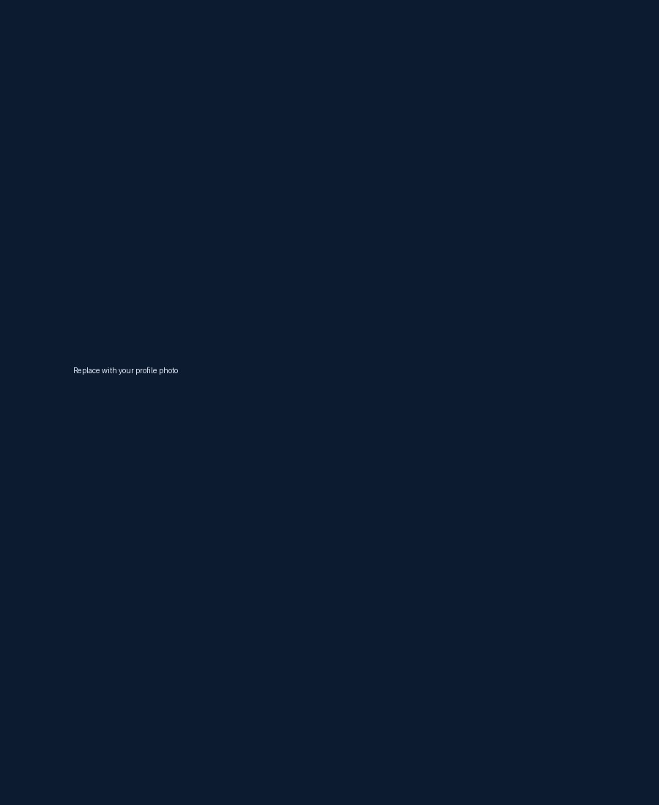

<!doctype html>
<html lang="ko">
<head>
  <meta charset="utf-8" />
  <meta name="viewport" content="width=device-width, initial-scale=1" />
  <meta name="description" content="홍창호의 스포츠심리학 및 e스포츠 연구 포트폴리오" />
  <meta name="theme-color" content="#06111f" />

  <meta property="og:title" content="홍창호 | 스포츠심리학 · e스포츠 연구" />
  <meta property="og:description" content="경기 상황에서의 정서와 수행을 연구합니다." />
  <meta property="og:type" content="website" />

  <title>홍창호 | 스포츠심리학 · e스포츠 연구</title>

  <link rel="preconnect" href="https://fonts.googleapis.com" />
  <link rel="preconnect" href="https://fonts.gstatic.com" crossorigin />
  <link href="https://fonts.googleapis.com/css2?family=Inter:wght@500;600;700;800&family=Noto+Sans+KR:wght@400;500;600;700;800&display=swap" rel="stylesheet" />
  <link rel="stylesheet" href="style.css" />
  
</head>

<body>
  <header class="site-header">
    

      <a class="brand" href="#home" aria-label="홈으로 이동">CH</a>

      <button class="menu-button" type="button" aria-label="메뉴 열기" aria-expanded="false">
        
      </button>

      <nav class="main-nav" aria-label="주요 메뉴">
        <a href="#home" class="active">HOME</a>
        <a href="#about">ABOUT</a>
        <a href="#research">RESEARCH</a>
        <a href="#esports">ESPORTS</a>
        <a href="#experience">EXPERIENCE</a>
        <a href="#publications">PUBLICATIONS</a>
        <a href="#contact">CONTACT</a>
      </nav>
    

  </header>

  <main>
    <section class="hero" id="home">
      

      

        

          <h1>홍 창 호</h1>
          
스포츠심리학 석사과정생

          

            스포츠심리학과 e스포츠를 연결하여, 
            경기 상황에서의 정서와 수행을 연구합니다.
          

          

            <a class="button button-primary" href="#research">Research 보기</a>
            <a class="button button-ghost" href="assets/cv.pdf" download>CV 다운로드 ↓</a>
          

        

        

          
          

            SPORTS PSYCHOLOGY
            ESPORTS RESEARCH
          

        

      

      <a class="scroll-down" href="#about" aria-label="소개 섹션으로 이동">↓</a>
    </section>

    <section class="section about" id="about">
      

        <article class="about-copy reveal">
          

            <h2>ABOUT</h2>
            
          

          <h3>안녕하세요, 홍창호입니다.</h3>
          

            저는 스포츠심리학을 기반으로 e스포츠 선수와 참가자의 심리적 특성,
            정서조절, 수행 향상에 대해 연구하고 있습니다. 연구를 통해 이론과 이해를
            넓히고, 실제 현장에 적용 가능한 심리적 지원 방안을 마련하는 것을 목표로 합니다.
          

        </article>

        <article class="panel education reveal delay-1">
          <h3>학력</h3>
          <ol class="education-list">
            <li>
              <time>2016.03 - 2019.02</time>
              
청주외국어고등학교

            </li>
            <li>
              <time>2019.03 - 2025.02</time>
              
충남대학교 독어독문학과

            </li>
            <li>
              <time>2022.09 - 2025.02</time>
              
스포츠심리상담 복수전공

            </li>
            <li>
              <time>2025.03 - 현재</time>
              
충남대학교 일반대학원 스포츠과학과 석사과정

            </li>
          </ol>
        </article>

        <article class="panel philosophy reveal delay-2">
          <h3>연구철학</h3>
          “
          <blockquote>
            선수의 마음을 이해하는 것이 
            경기력을 이해하는 첫걸음입니다. 
            과학적 연구와 현장 경험을 연결하여 
            선수와 팀의 성장을 돕는 연구자가 
            되고 싶습니다.
          </blockquote>
          ”
        </article>
      

    </section>

    <section class="section research" id="research">
      

        

          <h2>RESEARCH</h2>
          
        

        

          <h3>현재 연구</h3>
          
e스포츠 참가자의 Tilt, 정서조절 전략이 경기수행과 팀 퍼포먼스에 미치는 영향

          <h3 class="interest-title">관심 분야</h3>
          

            e스포츠
            정서조절
            경기수행
            Tilt
            스포츠심리상담
          

        

      

    </section>

    <section class="section esports" id="esports">
      

      

        

          <h2>ESPORTS</h2>
          
        

        

          <article class="esports-item reveal">
            
🎮

            

              <h3>즐기는 게임</h3>
              <ul>
                <li>League of Legends</li>
                <li>PUBG: BATTLEGROUNDS</li>
                <li>OVERWATCH 2</li>
                <li>ETERNAL RETURN</li>
              </ul>
            

          </article>

          <article class="esports-item reveal delay-1">
            
♡

            

              <h3>관심 분야</h3>
              <ul>
                <li>e스포츠 선수 심리</li>
                <li>팀 커뮤니케이션</li>
                <li>경기 중 정서 변화</li>
                <li>멘탈 코칭 및 상담</li>
              </ul>
            

          </article>

          <article class="esports-item reveal delay-2">
            
↗

            

              <h3>연구와의 연결성</h3>
              

                실제 게임 경험을 통해 선수의 심리와 행동을 이해하고,
                연구 주제와 현장을 연결하는 연구를 지향합니다.
              

            

          </article>
        

      

    </section>

    <section class="section experience" id="experience">
      

        

          <h2>EXPERIENCE</h2>
          
        

        

          <article class="info-item reveal">
            
⌁

            

              <h3>학회 활동</h3>
              <ul>
                <li>한국스포츠심리학회 준회원</li>
                <li>한국체육학회 일반회원</li>
              </ul>
            

          </article>

          <article class="info-item reveal delay-1">
            
▢

            

              <h3>프로젝트</h3>
              <ul>
                <li>e스포츠 심리 실태 조사 프로젝트</li>
                <li>대학생 e스포츠 심리 지원 방안 연구</li>
                <li>팀 기반 퍼포먼스 분석 프로젝트</li>
              </ul>
            

          </article>

          <article class="info-item reveal delay-2">
            
♙

            

              <h3>교육 및 활동</h3>
              <ul>
                <li>스포츠심리상담사 2급 수료</li>
              </ul>
            

          </article>
        

      

    </section>

    <section class="section publications" id="publications">
      

        

          <h2>PUBLICATIONS</h2>
          
        

        

          <article class="publication-item reveal">
            <h3>논문</h3>
            <ul>
              <li>e스포츠 참가자의 틸트 경험, 상태불안, 정서조절 및 경기성과 간의 관계 (석사 학위논문 진행 중)</li>
            </ul>
          </article>

          <article class="publication-item reveal delay-1">
            <h3>발표</h3>
            <ul>
              <li>제107회 전국체육대회기념 제64회 한국체육학회 학술대회 (예정)</li>
            </ul>
          </article>

          <article class="publication-item reveal delay-2">
            <h3>스터디</h3>
            <ul>
              <li>스포츠심리 논문 세미나 참여</li>
              <li>연구 방법론 스터디 그룹 활동</li>
            </ul>
          </article>
        

      

    </section>

    <section class="section contact" id="contact">
      

        

          

            <h2>CONTACT</h2>
            
          

          <ul class="contact-list">
            <li>✉<a href="mailto:ghd315988@naver.com">ghd315988@naver.com</a></li>
            <li>⌖Republic of Korea</li>
          </ul>

          

            <a href="https://github.com/" target="_blank" rel="noopener">GitHub</a>
            <a href="#" aria-label="Google Scholar 주소 입력 필요">Google Scholar</a>
            <a href="#" aria-label="LinkedIn 주소 입력 필요">LinkedIn</a>
          

        

        <form class="contact-form reveal delay-1" action="https://formspree.io/f/YOUR_FORM_ID" method="POST">
          

            <label>
              이름
              <input name="name" type="text" placeholder="이름" required />
            </label>
            <label>
              이메일
              <input name="email" type="email" placeholder="이메일" required />
            </label>
          

          <label>
            메시지
            <textarea name="message" rows="5" placeholder="메시지" required></textarea>
          </label>
          <button class="button button-primary submit-button" type="submit">보내기</button>
        </form>
      

      

        <small>© 2026 Hong Changho. All rights reserved.</small>
        <a class="to-top" href="#home" aria-label="페이지 위로 이동">↑</a>
      

    </section>
  </main>
</body>
</html>
